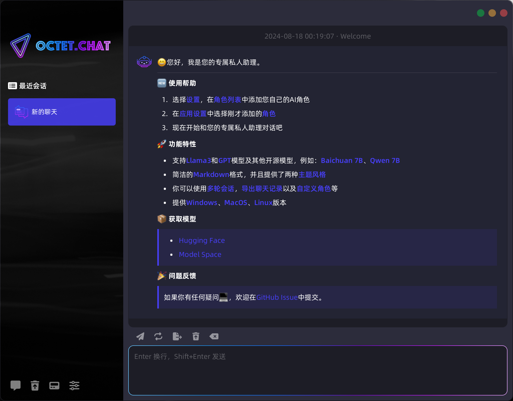

# 🚀 Octet.Chat


[](https://github.com/eoctet/octet.chat/actions/workflows/maven_build_deploy.yml)
[](https://mvnrepository.com/artifact/chat.octet/llama-java-core)
[](./README.md)
[](https://opensource.org/licenses/MIT)

这是一个Java实现的LLMs项目。你可以用它部署自己的私有服务，支持 `Llama3` 和 `GPT` 模型及其他开源模型。

#### 提供
- `llama-java-core` 简单易用的Java库
- `octet-chat-app` 桌面聊天助手
- `octet-chat-app` API 服务

#### 主要特点
- 🦙 基于  [`llama.cpp`](https://github.com/ggerganov/llama.cpp) 构建
- 😊 支持 `AI Agent`，基于 `Qwen-chat` 实现 `Function calling`
- 🤖 支持 `并行推理`、`连续对话` 和 `文本生成`
- 📦 支持 `Llama3` 和 `GPT` 模型及其他开源模型，例如：`Baichuan 7B`、`Qwen 7B`

----

<details>

<summary>最近更新</summary>

   ...

- [X] 🚀 支持动态温度采样
- [X] 🚀 Octet-chat-app 增加了 WebUI
- [X] 🚀 更新API参数
- [X] 🚀 优化聊天提示词解析、Windows Cli
- [X] 🚀 重构函数调用，优化聊天提示词解析和接口

</details>

## 快速开始

> [!NOTE] 
>
> 你可以自行量化原始模型或搜索 `huggingface` 获取开源模型。


### 🖥 Octet desktop




### 💡 API servers

__如何使用__

首先设置一个自定义的AI角色，启动服务，打开浏览器开始聊天，默认地址：`http://YOUR_IP_ADDR:8152/`

```bash
# Default URL: http://YOUR_IP_ADDR:8152/

cd <YOUR_PATH>/octet-chat-app
bash app_server.sh start YOUR_CHARACTER
```

> [!TIP]
>
> 你也可以将API服务集成到你的应用中，例如：`VsCode`、`App`、`Wechat`等。

<details>

<summary>如何调用API</summary>

> Api docs: http://127.0.0.1:8152/swagger-ui.html

```shell
curl --location 'http://127.0.0.1:8152/v1/chat/completions' \
--header 'Content-Type: application/json' \
--data '{
    "messages": [
        {
            "role": "USER",
            "content": "Who are you?"
        }
    ],
    "user": "User",
    "stream": true
}'
```

接口将以流的方式返回数据：

```json
{
    "id": "octetchat-98fhd2dvj7",
    "model": "Llama2-chat",
    "created": 1695614393810,
    "choices": [
        {
            "index": 0,
            "delta": {
                "content": "你好"
            },
            "finish_reason": "NONE"
        }
    ]
}
```

</details>


## 帮助文档

__开发文档__

- __[开发手册](https://github.com/eoctet/octet.chat/wiki/开发手册)__
- __[Development manual](https://github.com/eoctet/octet.chat/wiki/Development-manual)__

__角色配置__

- __[Llama Java Parameter](https://github.com/eoctet/octet.chat/wiki/Llama-Java-parameters)__
- __[characters.template.json](octet-chat-app/characters/characters.template.json)__


## 免责声明

> [!IMPORTANT]
> 
> - 本项目不提供任何模型，请自行获取模型文件并遵守相关协议。
> - 请勿将本项目用于非法用途，包括但不限于商业用途、盈利用途、以及违反法律法规的用途。
> - 因使用本项目所产生的任何法律责任，由使用者自行承担，本项目不承担任何法律责任。

## 问题反馈

- 如果你有任何疑问，欢迎在GitHub Issue中提交。
