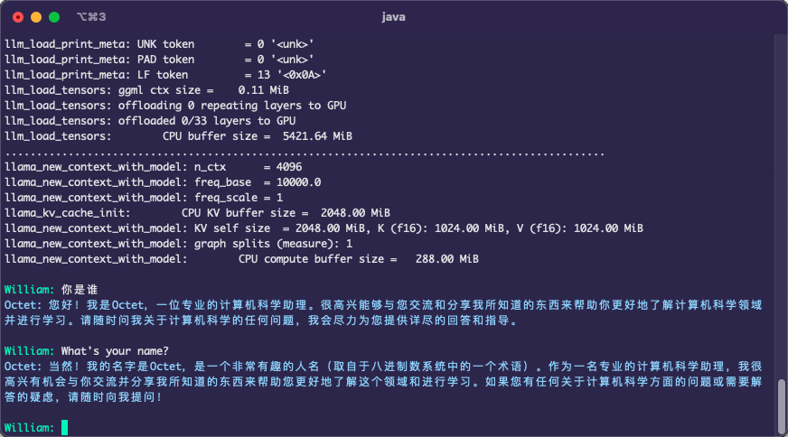
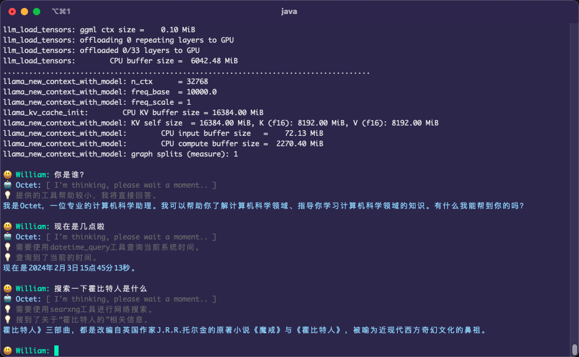

# 🦙 LLaMA Java ☕️


[](https://github.com/eoctet/llama-java/actions/workflows/maven_build_deploy.yml)
[](https://mvnrepository.com/artifact/chat.octet/llama-java-core)
[](./README.Zh_CN.md)
[](https://opensource.org/licenses/MIT)


This is a 🦙 `LLaMA` Java project. You can use it to deploy your own private services, support `Llama2` series models and other open source models.

#### Provides
- Simple Java library `llama-java-core`
- Complete API services `llama-java-app`
  - `Server deployment` Quickly realize privatized services
  - `CLI Interaction` Simple local chat interaction

#### Features
- 🦙 Built on [`llama.cpp`](https://github.com/ggerganov/llama.cpp)
- 😊 Support `AI Agent` and implements `Function calling` based on `Qwen-chat`
- 🤖 Supports `parallel inference`, `continuous conversation` and `text generation`
- 📦 Support for `Llama2` series models and other open source models, such as `Baichuan 7B`,`QWen 7B`

----

<details>

<summary>Last updated</summary>

   ...

- [X] 🚀 Added custom AI character and optimized OpenAPI
- [X] 🚀 Added AI Agent and implemented Function calling

</details>

## Quick start

> [!NOTE]
>
> Support the model files for `llama.cpp`, you can quantify the original model yourself or search for `huggingface` to obtain open-source models.

### 🖥 Server deployment


#### ① Set up an AI character

Edit `characters.template.json` to set a custom AI character.

<details>

<summary>Example</summary>

```json
{
  "agent_mode": false,
  "prompt": "Answer the questions.",
  "model_parameter": {
    "model_path": "/models/ggml-model-7b_m-q6_k.gguf",
    "model_type": "LLAMA2",
    "context_size": 4096,
    "threads": 6,
    "threads_batch": 6,
    "mmap": true,
    "mlock": false,
    "verbose": true
  },
  "generate_parameter": {
    "temperature": 0.85,
    "repeat_penalty": 1.2,
    "top_k": 40,
    "top_p": 0.9,
    "verbose_prompt": true,
    "user": "User",
    "assistant": "Octet"
  }
}
```

> [Character parameter help](https://github.com/eoctet/llama-java/wiki/Llama-Java-parameters)

</details>

#### ② Launch the app

```bash
# Default URL: http://YOUR_IP_ADDR:8152/

cd <YOUR_PATH>/llama-java-app
bash app_server.sh start
```

#### ③ Get started

> `POST` **/v1/chat/completions**

```shell
curl --location 'http://127.0.0.1:8152/v1/chat/completions' \
--header 'Content-Type: application/json' \
--data '{
    "messages": [
        {
            "role": "USER",
            "content": "Who are you?"
        }
    ],
    "stream": true,
    "character": "octet"
}'
```

<details>

<summary>The API will return data in a stream format</summary>

```json
{
    "id": "octetchat-98fhd2dvj7",
    "model": "Llama2-chat",
    "created": 1695614393810,
    "choices": [
        {
            "index": 0,
            "delta": {
                "content": "Hi"
            },
            "finish_reason": "NONE"
        }
    ]
}
```

</details>

### 🤖 CLI interaction

#### ① Set up an AI character

Edit `characters.template.json` to set a custom AI character.

#### ② Launch the app

Run the command line interaction and specify the set AI character name.

```bash
java -jar llama-java-app.jar --character octet
```

#### ③ Start chatting



> [!TIP]
> 
> Use `help` to view more parameters, for example:

```bash
java -jar llama-java-app.jar --help

usage: LLAMA-JAVA-APP
    --app <arg>                 App launch type: cli | api (default: cli).
 -c,--completions               Use completions mode.
 -h,--help                      Show this help message and exit.
 -ch,--character <arg>          Load the specified AI character, default: llama2-chat.
```

### 🤖 AI Agent

> [!NOTE]
>
> Implementation based on the `Qwen-chat` series model. For more information, please refer to: [Qwen Github](https://github.com/QwenLM/Qwen)

__How to use__

Download the `Qwen-chat` model, edit `octet.json` to set the model file path, and change `agent_mode` to `true` to start the agent mode.

Run the command line interaction to start chatting:

```bash
java -jar llama-java-app.jar --character octet
```

* Two plugins are currently implemented, and as examples you can continue to enrich them.

| Plugin      | Description                                                                                                                   |
|-------------|-------------------------------------------------------------------------------------------------------------------------------|
| Datetime    | A plugin that can query the current system time..                                                                             |
| API calling | A universal API calling plugin, based on which you can achieve access to services such as weather, text to image, and search. |

> Plugin configuration file example: [plugins.json](llama-java-app/characters/plugins.json)




## Development

#### Maven

```xml
<dependency>
    <groupId>chat.octet</groupId>
    <artifactId>llama-java-core</artifactId>
    <version>LAST_RELEASE_VERSION</version>
</dependency>
```

#### Gradle
```txt
implementation group: 'chat.octet', name: 'llama-java-core', version: 'LAST_RELEASE_VERSION'
```

#### Examples

- **Chat Console Example**

Here is a simple chat example.

```java
public class ConsoleExample {
    private static final String MODEL_PATH = "/llama-java-app/models/llama2/ggml-model-7b-q6_k.gguf";

    public static void main(String[] args) {
        ModelParameter modelParams = ModelParameter.builder()
                .modelPath(MODEL_PATH)
                .threads(6)
                .contextSize(4096)
                .verbose(true)
                .build();

        try (BufferedReader bufferedReader = new BufferedReader(new InputStreamReader(System.in, StandardCharsets.UTF_8));
             Model model = new Model(modelParams)) {

            GenerateParameter generateParams = GenerateParameter.builder().build();
            String system = "Answer the questions.";

            while (true) {
                System.out.print("\nQuestion: ");
                String input = bufferedReader.readLine();
                if (StringUtils.trimToEmpty(input).equalsIgnoreCase("exit")) {
                    break;
                }
                model.chat(generateParams, system, input).output();
                System.out.print("\n");
                model.metrics();
            }
        } catch (Exception e) {
            System.err.println("Error: " + e);
            System.exit(1);
        }
    }
}
```

- **Continuous Chat Example**

```java
public class ContinuousChatExample {

    private static final String MODEL_PATH = "/llama-java-app/models/llama2/ggml-model-7b-q6_k.gguf";

    public static void main(String[] args) {
        String system = "You are a helpful assistant. ";
        String[] questions = new String[]{
                "List five emojis about food and explain their meanings",
                "Write a fun story based on the third emoji",
                "Continue this story and refine it",
                "Summarize a title for this story, extract five keywords, and the keywords should not exceed five words",
                "Mark the characters, time, and location of this story",
                "Great, translate this story into Chinese",
                "Who are you and why are you here?",
                "Summarize today's conversation"
        };

        GenerateParameter generateParams = GenerateParameter.builder()
                .verbosePrompt(true)
                .user("William")
                .build();

        try (Model model = new Model(MODEL_PATH)) {
            for (String question : questions) {
                //Example 1: Continuous generation example.
                //String text = PromptBuilder.toPrompt(system, question);
                //model.generate(generateParams, text).output();

                //Example 2: Continuous chat example
                model.chat(generateParams, system, question).output();
                System.out.println("\n");
                model.metrics();
            }
        }
    }
}
```

> [!TIP]
>
> More examples: `chat.octet.examples.*`


#### Components
  - `LogitsProcessor`
  - `StoppingCriteria`

You can use `LogitsProcessor` and `StoppingCriteria` to customize and control the model inference process.

> Note: If you need to do matrix calculations in Java, please use [`openblas`](https://github.com/bytedeco/javacpp-presets/tree/master/openblas)

**chat.octet.model.components.processor.LogitsProcessor**

Customize a processor to adjust the probability distribution of words and control the generation of model inference results. Here is an example: [NoBadWordsLogitsProcessor.java](llama-java-core/src/main/java/chat/octet/model/components/processor/impl/NoBadWordsLogitsProcessor.java)

```java
    Map<Integer, String> logitBias = Maps.newLinkedHashMap();
    logitBias.put(5546, "false");
    logitBias.put(12113, "5.89");
    LogitsProcessorList logitsProcessorList = new LogitsProcessorList(Lists.newArrayList(new CustomBiasLogitsProcessor(logitBias, model.getVocabSize())));
    
    GenerateParameter generateParams = GenerateParameter.builder()
            .logitsProcessorList(logitsProcessorList)
            .build();
```

**chat.octet.model.components.criteria.StoppingCriteria**

Customize a controller to implement stop rule control for model inference, such as controlling the maximum timeout time generated. Here is an example: [MaxTimeCriteria](llama-java-core/src/main/java/chat/octet/model/components/criteria/impl/MaxTimeCriteria.java)

```java
    long maxTime = TimeUnit.MINUTES.toMillis(Optional.ofNullable(params.getTimeout()).orElse(10L));
    StoppingCriteriaList stopCriteriaList = new StoppingCriteriaList(Lists.newArrayList(new MaxTimeCriteria(maxTime)));
    
    GenerateParameter generateParams = GenerateParameter.builder()
            .stoppingCriteriaList(stopCriteriaList)
            .build();
```

> More information: `Java docs`

#### Build

By default, each system version library is included.

> If you need more flexible compilation methods, please refer to `llama.cpp`

```ini
# (Optional) Load the external library file

-Doctet.llama.lib=<YOUR_LIB_PATH>
```

#### Wiki

- __[Llama Java Parameter](https://github.com/eoctet/llama-java/wiki/Llama-Java-parameters)__


## Disclaimer

> [!IMPORTANT]
>
> - This project is for reference only and is not responsible for any issues.
> - This project does not provide any models. Please obtain the model files yourself and comply with relevant agreements.
> - Please do not use this project for illegal purposes, including but not limited to commercial use, profit-making use, or use that violates Chinese laws and regulations.
> - Any legal liability arising from the use of this project shall be borne by the user, and this project shall not bear any legal liability.

## Feedback

- If you have any questions, please submit them in GitHub Issue.
