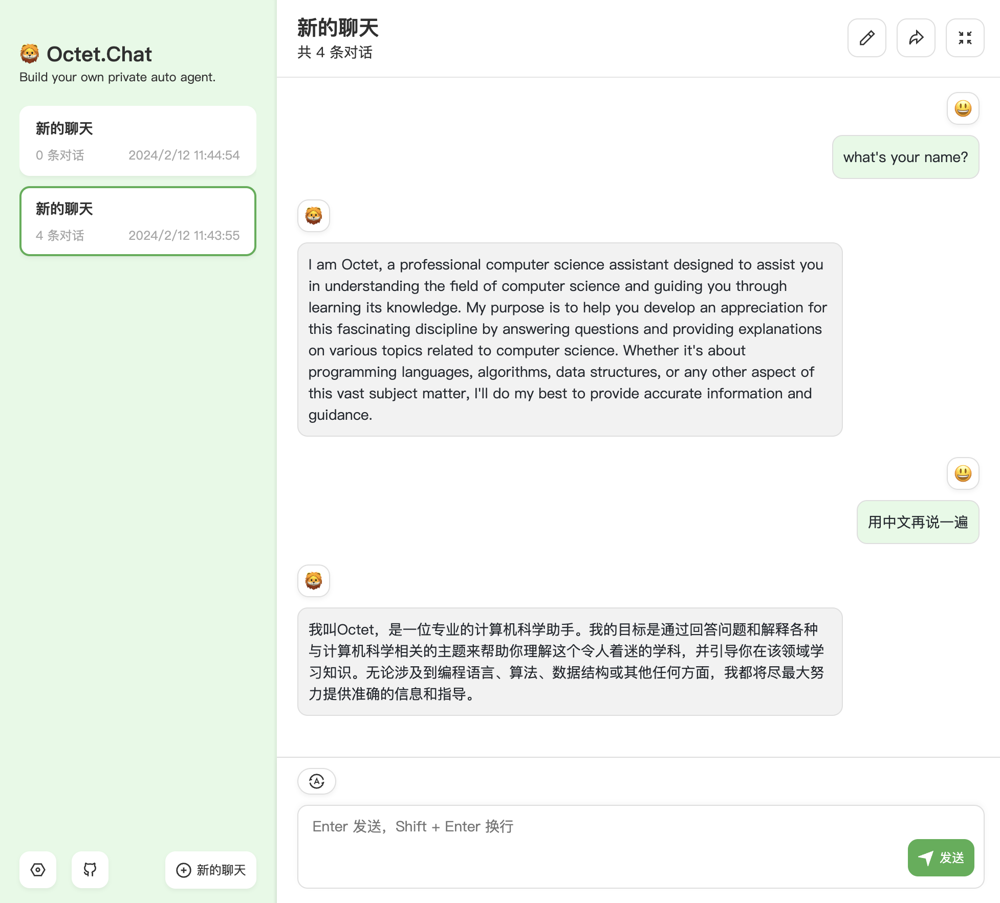

# 🦙 LLaMA Java ☕️


[](https://github.com/eoctet/llama-java/actions/workflows/maven_build_deploy.yml)
[](https://mvnrepository.com/artifact/chat.octet/llama-java-core)
[](./README.Zh_CN.md)
[](https://opensource.org/licenses/MIT)


This is a 🦙 `LLaMA` Java project. You can use it to deploy your own private services, support `Llama2` series models and other open source models.

#### Provides
- Simple Java library `llama-java-core`
- Complete API services `llama-java-app`
  - `Server deployment` to quickly realize privatized services
  - `CLI Interaction`, simple local chat interaction

#### Features
- 🦙 Built on [`llama.cpp`](https://github.com/ggerganov/llama.cpp)
- ☕️ Develop using `JNI`, Provides a consistent API with `Llama.cpp`
- 🤖 Supports `parallel inference`, `continuous conversation` and `text generation`
- 📦 Support for `Llama2` series models and other open source models, such as `Baichuan 7B`,`QWen 7B`

----

<details>

<summary>Last updated</summary>

- [X] 🚀 Provide model quantification API
- [X] 🚀 Custom model prompt templates (such as Vicuna, Alpaca, etc.)
- [X] 🚀 Parallel batch decoding
- [X] 🚀 Min-P sampling support
- [X] 🚀 YaRN RoPE scaling support

</details>

## Quick start

#### 🖥 Server deployment

- Download & Starting server

```bash
# Default URL: http://YOUR_IP_ADDR:8152/

cd <YOUR_PATH>/llama-java-app
bash app_server.sh start
```

- Directory

```text
=> llama-java-app
   ⌊___ llama-java-app.jar
   ⌊___ app_server.sh
   ⌊___ conf
        ⌊___ setting.json

···
```

Following the interface specifications of `ChatGPT`, only the main interfaces are implemented, It can be integrated with [`ChatGPT Next Web`](https://github.com/Yidadaa/ChatGPT-Next-Web), WebUI, and App for use.

> [!NOTE]
> 1. Added parameters for the Llama series model and removed unsupported GPT parameters;
> 2. By default, the `Llama2-chat` prompt template is used. If you need to adapt to other models, you can adjust it yourself;
> 3. There are no unnecessary functions such as requesting authentication and usage queries;
> 4. Optimize the conversation and chat API, without the need to pass on historical conversation context, only the current conversation content is sufficient.
>
> More information: [`API Docs`](docs/API.md).



For example

> `POST` **/v1/chat/completions**

```shell
curl --location 'http://127.0.0.1:8152/v1/chat/completions' \
--header 'Content-Type: application/json' \
--data '{
    "messages": [
        {
            "role": "SYSTEM",
            "content": "<YOUR_PROMPT>"
        },
        {
            "role": "USER",
            "content": "Who are you?"
        }
    ],
    "user": "william",
    "verbose": true,
    "stream": true,
    "model": "Llama2-chat"
}'
```

The API will return data in a stream format:

```json
{
    "id": "octetchat-98fhd2dvj7",
    "model": "Llama2-chat",
    "created": 1695614393810,
    "choices": [
        {
            "index": 0,
            "delta": {
                "content": "Hi"
            },
            "finish_reason": "NONE"
        }
    ]
}
```

#### 🤖 CLI interaction

Run command line interaction and specify the language model that needs to be loaded.

```bash
java -jar llama-java-app.jar --model llama2-chat --system 'YOUR_PROMPT'
```

```txt
... ...

User: Who are you
AI: As an AI, I don't know who I am. My designers and creators created me. 
However, I am a virtual assistant designed to provide assistance and answer questions.
```

> [!TIP]
> 
> Use `help` to view more generate parameters, for example:

```bash
java -jar llama-java-app.jar --help

usage: LLAMA-JAVA-APP
    --app <arg>                 App launch type: cli | api (default: cli).
 -c,--completions               Use completions mode.
    --frequency-penalty <arg>   Repeat alpha frequency penalty (default:
                                0.0, 0.0 = disabled)
 -h,--help                      Show this help message and exit.
 -m,--model <arg>               Load model name, default: llama2-chat.
    --max-new-tokens <arg>      Maximum new token generation size
                                (default: 0 unlimited).
    --min-p <arg>               Min-p sampling (default: 0.05, 0 =
                                disabled).
    --mirostat <arg>            Enable Mirostat sampling, controlling
                                perplexity during text generation
                                (default: 0, 0 = disabled, 1 = Mirostat, 2
                                = Mirostat 2.0).
    --mirostat-ent <arg>        Set the Mirostat target entropy, parameter
                                tau (default: 5.0).
    --mirostat-lr <arg>         Set the Mirostat learning rate, parameter
                                eta (default: 0.1).
    --no-penalize-nl <arg>      Disable penalization for newline tokens
                                when applying the repeat penalty (default:
                                true).
    --presence-penalty <arg>    Repeat alpha presence penalty (default:
                                0.0, 0.0 = disabled)
    --repeat-penalty <arg>      Control the repetition of token sequences
                                in the generated text (default: 1.1).
    --system <arg>              Set a system prompt.
    --temperature <arg>         Adjust the randomness of the generated
                                text (default: 0.8).
    --tfs <arg>                 Enable tail free sampling with parameter z
                                (default: 1.0, 1.0 = disabled).
    --top-k <arg>               Top-k sampling (default: 40, 0 =
                                disabled).
    --top-p <arg>               Top-p sampling (default: 0.9).
    --typical <arg>             Enable typical sampling sampling with
                                parameter p (default: 1.0, 1.0 =
                                disabled).
    --verbose-prompt            Print the prompt before generating text.
```

## Development

#### Maven

```xml
<dependency>
    <groupId>chat.octet</groupId>
    <artifactId>llama-java-core</artifactId>
    <version>LAST_RELEASE_VERSION</version>
</dependency>
```

#### Gradle
```txt
implementation group: 'chat.octet', name: 'llama-java-core', version: 'LAST_RELEASE_VERSION'
```

#### Examples

- **Chat Console Example**

Here is a simple chat example.

```java
public class ConsoleExample {
    private static final String MODEL_PATH = "/llama-java-app/models/llama2/ggml-model-7b-q6_k.gguf";

    public static void main(String[] args) {
        ModelParameter modelParams = ModelParameter.builder()
                .modelPath(MODEL_PATH)
                .threads(6)
                .contextSize(4096)
                .verbose(true)
                .build();

        try (BufferedReader bufferedReader = new BufferedReader(new InputStreamReader(System.in, StandardCharsets.UTF_8));
             Model model = new Model(modelParams)) {

            GenerateParameter generateParams = GenerateParameter.builder().build();
            String system = "Answer the questions.";

            while (true) {
                System.out.print("\nQuestion: ");
                String input = bufferedReader.readLine();
                if (StringUtils.trimToEmpty(input).equalsIgnoreCase("exit")) {
                    break;
                }
                model.chat(generateParams, system, input).output();
                System.out.print("\n");
                model.metrics();
            }
        } catch (Exception e) {
            System.err.println("Error: " + e);
            System.exit(1);
        }
    }
}
```

- **Continuous Chat Example**

```java
public class ContinuousChatExample {

    private static final String MODEL_PATH = "/llama-java-app/models/llama2/ggml-model-7b-q6_k.gguf";

    public static void main(String[] args) {
        String system = "You are a helpful assistant. ";
        String[] questions = new String[]{
                "List five emojis about food and explain their meanings",
                "Write a fun story based on the third emoji",
                "Continue this story and refine it",
                "Summarize a title for this story, extract five keywords, and the keywords should not exceed five words",
                "Mark the characters, time, and location of this story",
                "Great, translate this story into Chinese",
                "Who are you and why are you here?",
                "Summarize today's conversation"
        };

        GenerateParameter generateParams = GenerateParameter.builder()
                .verbosePrompt(true)
                .user("William")
                .build();

        try (Model model = new Model(MODEL_PATH)) {
            for (String question : questions) {
                //Example 1: Continuous generation example.
                //String text = PromptBuilder.toPrompt(system, question);
                //model.generate(generateParams, text).output();

                //Example 2: Continuous chat example
                model.chat(generateParams, system, question).output();
                System.out.println("\n");
                model.metrics();
            }
        }
    }
}
```

> [!TIP]
>
> More examples: `chat.octet.examples.*`


#### Components
  - `LogitsProcessor`
  - `StoppingCriteria`

You can use `LogitsProcessor` and `StoppingCriteria` to customize and control the model inference process.

> Note: If you need to do matrix calculations in Java, please use [`openblas`](https://github.com/bytedeco/javacpp-presets/tree/master/openblas)

**chat.octet.model.components.processor.LogitsProcessor**

Customize a processor to adjust the probability distribution of words and control the generation of model inference results. Here is an example: [NoBadWordsLogitsProcessor.java](llama-java-core/src/main/java/chat/octet/model/components/processor/impl/NoBadWordsLogitsProcessor.java)

```java
    Map<Integer, String> logitBias = Maps.newLinkedHashMap();
    logitBias.put(5546, "false");
    logitBias.put(12113, "5.89");
    LogitsProcessorList logitsProcessorList = new LogitsProcessorList(Lists.newArrayList(new CustomBiasLogitsProcessor(logitBias, model.getVocabSize())));
    
    GenerateParameter generateParams = GenerateParameter.builder()
            .logitsProcessorList(logitsProcessorList)
            .build();
```

**chat.octet.model.components.criteria.StoppingCriteria**

Customize a controller to implement stop rule control for model inference, such as controlling the maximum timeout time generated. Here is an example: [MaxTimeCriteria](llama-java-core/src/main/java/chat/octet/model/components/criteria/impl/MaxTimeCriteria.java)

```java
    long maxTime = TimeUnit.MINUTES.toMillis(Optional.ofNullable(params.getTimeout()).orElse(10L));
    StoppingCriteriaList stopCriteriaList = new StoppingCriteriaList(Lists.newArrayList(new MaxTimeCriteria(maxTime)));
    
    GenerateParameter generateParams = GenerateParameter.builder()
            .stoppingCriteriaList(stopCriteriaList)
            .build();
```

> More information: `Java docs`

#### Build

By default, each system version library is included.

> If you need more flexible compilation methods, please refer to `llama.cpp`

```ini
# (Optional) Load the external library file

-Doctet.llama.lib=<YOUR_LIB_PATH>
```

#### Wiki

- __[Llama Java Parameter](https://github.com/eoctet/llama-java/wiki/Llama-Java-parameters)__


## Disclaimer

> [!IMPORTANT]
>
> - This project is for reference only and is not responsible for any issues.
> - This project does not provide any models. Please obtain the model files yourself and comply with relevant agreements.
> - Please do not use this project for illegal purposes, including but not limited to commercial use, profit-making use, or use that violates Chinese laws and regulations.
> - Any legal liability arising from the use of this project shall be borne by the user, and this project shall not bear any legal liability.

## Feedback

- If you have any questions, please submit them in GitHub Issue.
